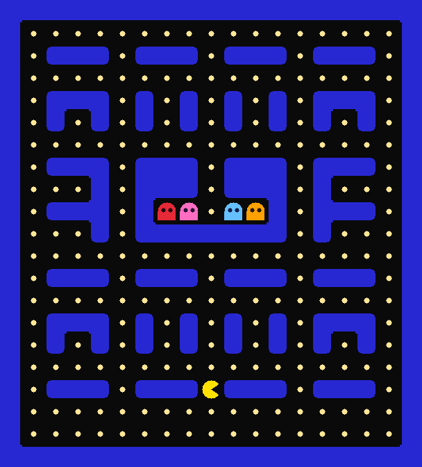

# Grid++

**Grid++** 是一個專為「程式初學者」設計的輕量化、網格導向（grid-based）遊戲引擎。
它把圖形繪製、遊戲主循環、檔案讀取的複雜度全部藏起來，提供「一行搞定」的 API，
同時刻意留出接口，引導你練習 C++ 的物件導向（繼承、覆寫、重載、封裝）。



## 特色

- **Header-only**：`#include "GridPlusPlus.h"` 就能開始寫，不需編譯整個函式庫。
- **一行 API**：開視窗、載素材、放物件、開跑，各一行。
- **OOP 教學核心**：繼承 `GridObject`，覆寫 `onStart` / `onUpdate` / `onCollide`。
- **不需要連結 SQLite**：素材包 `.db` 由引擎內建的迷你讀取器處理。
- **選用的迷宮模組**：`GridMaze` 可讀地圖、自動拼接牆壁外觀、提供碰撞查詢。
- **唯一依賴 [raylib](https://www.raylib.com/)**：只負責開視窗與畫圖。

## 最小範例

```cpp
#include "GridPlusPlus.h"

class Player : public GridObject {
public:
    Player() : GridObject("hero", 5, 5) {}
    void onUpdate() override {
        if (IsKeyPressed(KEY_RIGHT)) move(1, 0);
    }
};

int main() {
    GridEngine game(10, 10, 32);   // 10x10 網格，每格 32 像素
    game.loadAssets("assets.db");
    game.spawn(new Player());
    game.run();
}
```

可直接編譯的起手式模板在根目錄的 [`template.cpp`](template.cpp)（不需素材包就能跑）。

## 快速開始

詳細的安裝與三平台編譯說明見 [docs/getting-started.md](docs/getting-started.md)。簡述：

1. **安裝 raylib**——Windows 用 MSYS2（`pacman -S mingw-w64-x86_64-raylib`）、
   Linux 用套件管理器（`libraylib-dev`）、macOS 用 Homebrew（`brew install raylib`）。
2. **編譯模板**（在專案根目錄）：

   ```bash
   # Windows / MinGW
   g++ template.cpp -o game -lraylib -lopengl32 -lgdi32 -lwinmm
   # Linux
   g++ template.cpp -o game -lraylib -lGL -lm -lpthread -ldl -lrt -lX11
   # macOS
   clang++ template.cpp -o game -lraylib -framework OpenGL -framework Cocoa \
       -framework IOKit -framework CoreVideo -framework CoreAudio
   ```

3. 執行 `./game`，用方向鍵移動角色。

## 專案結構

| 路徑 | 說明 |
|---|---|
| `GridPlusPlus.h` | 引擎核心（視窗、主循環、物件、碰撞、素材讀取器）。 |
| `GridMaze.h` | 選用的迷宮模組（讀地圖、牆壁自動拼接、碰撞查詢）。 |
| `GridUI.h` | 選用的 UI 元件（`Label` / `Button`）。 |
| `template.cpp` | 起手式模板：一個角色在邊界內移動，複製它開始寫自己的遊戲。 |
| `examples/pacman/` | 完整範例：用三個模組寫成的小 Pac-Man（見其 README）。 |
| `docs/` | 文件原始碼（[MkDocs](https://www.mkdocs.org/) 格式）。 |

## 範例

- **[Pac-Man](examples/pacman/)**——方向鍵移動、吃光豆子獲勝、被鬼抓到失敗。
  完整的編譯、玩法與程式邏輯見 [examples/pacman/README.md](examples/pacman/README.md)，
  逐行拆解見 [docs/tutorial/pacman.md](docs/tutorial/pacman.md)。

## 文件

完整指南、API 速查與引擎內部原理都在 [`docs/`](docs/index.md)，可用 MkDocs 在本機預覽：

```bash
pip install -r docs/requirements.txt
mkdocs serve
```

從 [開始使用](docs/getting-started.md) 與 [遊戲物件 (OOP)](docs/guide/game-objects.md) 兩篇入手最快。

## 授權

本專案採用 [MIT 授權](LICENSE)。依賴的 raylib 為 zlib/libpng 授權，請另行安裝。
