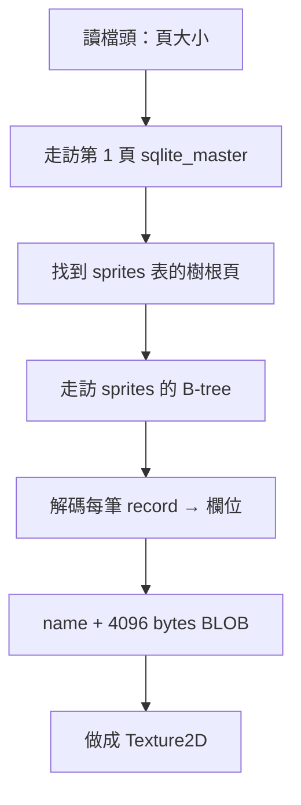

# 引擎內部原理

這一頁是給「好奇引擎怎麼運作」的人看的。寫遊戲完全不需要懂這些——但如果你想知道
Grid++ 為什麼不必安裝 SQLite 就能讀 `.db` 檔，這裡解釋它內建的迷你 SQLite 讀取器
（程式碼在 `GridPlusPlus.h` 的 `gridpp_detail` 命名空間，關鍵註解都還留在原始碼裡）。

## 為什麼要自己寫

要做到「Header-only、學生不必配置連結器」，把整個官方 SQLite（約 25 萬行）塞進標頭
並不實際。由於我們的資料表結構固定又簡單，乾脆**自己寫一個只夠用的純 C++ 讀取器**，
直接解析 `.db` 的檔案格式。代價是只支援讀取我們需要的東西，好處是零額外依賴。

## SQLite 檔案格式（極簡版）

- 檔案被切成固定大小的**頁（page）**，從第 1 頁開始編號。第 1 頁前面有 100 bytes 的總標頭。
- 資料用 **B-tree（平衡樹）** 存放。從某張表的「樹根頁」往下走訪，就能讀出整張表。
- B-tree 頁分兩種：**內部頁**（只是路標，指向子頁）和**葉頁**（真正存資料）。
- 每一列資料是一筆 **record**：開頭一段 header 用 **serial type** 描述每個欄位的型別與長度。
- 太大的資料（例如我們 4096 bytes 的圖片）會溢出到**溢位頁（overflow page）**，需要串回來。

## 讀取流程

對應到程式碼裡的幾個小工具：

| 函式 | 負責什麼 |
|---|---|
| `readVarint` | 解 SQLite 的變長整數（最高位元當「還有下一個」的旗標）。 |
| `readBE32` / `readBigEndianInt` | 讀大端序整數（頁碼、欄位值）。 |
| `decodeRecord` | 把一筆 record 的位元組依 serial type 拆成一排欄位。 |
| `walkTable` | 遞迴走訪 B-tree（內部頁往下、葉頁取資料），含溢位頁串接。 |

## 關於溢位頁的那幾條公式

`walkTable` 裡計算「多少資料留在本頁、多少要去溢位頁」的那幾行
（`X = usable - 35`、`M = ...`、`K = ...`）是 SQLite 官方規定的門檻公式，照抄即可。
我們的圖片每筆 4096 bytes，一定會觸發溢位，所以這段是讓素材能正確讀出的關鍵。

想看完整實作，直接讀 `GridPlusPlus.h` 的 Part A——程式碼本身就是最準確的文件。
