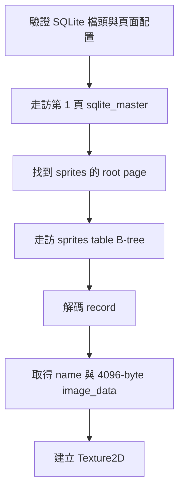

# 迷你 SQLite 讀取器

Grid++ 的素材包是 SQLite 檔，但學生編譯遊戲時不需要安裝或連結 SQLite。
`GridPlusPlus.h` 會自動引入 `GridSQLite.h`，再透過內部的 `SQLiteReader`
找出 `sprites` 資料表並取出素材。

## 為什麼自己讀檔案格式

這個專案希望學生直接看見編譯器收到哪些檔案與參數。若整合官方 SQLite，
編譯時還要加入額外的原始碼或函式庫；若把步驟包進 Makefile，又會把初學階段
正在學習的編譯流程藏起來。

因此 Grid++ 保留一個只夠讀素材包的迷你讀取器。它不是通用資料庫引擎：
不解析 SQL、不寫入資料，也不嘗試支援所有 SQLite 功能。

目前支援：

- UTF-8、非 WAL 的 SQLite 3 資料庫。
- table B-tree 的內部頁與葉頁。
- 素材包會用到的 NULL、INTEGER、TEXT、BLOB record 欄位。
- 跨 overflow pages 儲存的大型 BLOB。

不支援 WAL、UTF-16、索引 B-tree、SQL 查詢與寫入。遇到不支援或損壞的格式時，
讀取器會丟出例外，不會猜測資料內容。

## SQLite 檔案格式（極簡版）

- 檔案被切成固定大小的 page，從第 1 頁開始編號。
- 第 1 頁前面有 100 bytes 的資料庫檔頭，記錄 page size、編碼與格式版本。
- 每張資料表是一棵 B-tree；內部頁保存子頁頁碼，葉頁保存真正的資料列。
- 每列是一筆 record。record header 用 serial type 描述各欄型別與長度。
- 放不進葉頁的 payload 會接到一串 overflow pages。

## 讀取流程

`GridSQLite.h` 中的重要部分：

| 程式 | 負責什麼 |
|---|---|
| `SQLiteReader(data)` | 驗證 magic、page size、編碼、格式版本與檔案頁數。 |
| `readBEU16` / `readBEU32` | 讀取 SQLite 使用的 big-endian 無號整數。 |
| `readVarint` | 解碼最長 9 bytes 的 SQLite varint。 |
| `readBEI64` | 把 record 內 1～8 bytes 的有號整數轉成 `int64_t`。 |
| `decodeRecord` | 依 serial type 把 record 拆成一排欄位。 |
| `walkTable` | 從 root page 走訪 table B-tree，串接 overflow pages。 |

## 為什麼要做邊界檢查

解析二進位檔時，檔案裡的 page number、cell offset 與欄位長度都不能直接相信。
`SQLiteReader` 在每次讀取前檢查範圍，也會拒絕重複頁面、循環 overflow chain、
過深的 B-tree、截斷的 record，以及檔頭與實際大小不一致的資料庫。

這些檢查不會讓它變成完整 SQLite；目的只是確保不合法的素材包會明確失敗，
而不是讀到檔案範圍之外。

## Overflow payload 公式

`walkTablePage` 會依 SQLite 規格計算多少 payload 留在葉頁、多少接到 overflow pages。
其中 `maxLocal = usable - 35`、`minLocal = ((usable - 12) * 32 / 255) - 23`
等公式是檔案格式的一部分，不能自行簡化。每張素材是 4096 bytes，通常會走到這條路徑。

完整實作在 `GridSQLite.h`；素材載入端則在 `GridPlusPlus.h` 的
`GridAssetManager::load()`。
